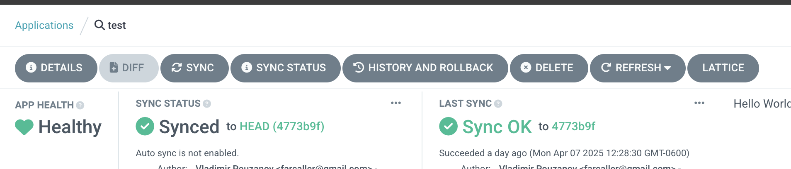
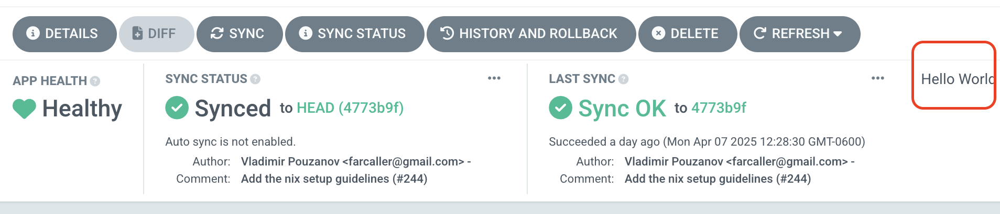

# Our extensions for ArgoCD

# Top Button
This would probably be the most useful of the options. This would allow us to easily direct users to click here for auto-sync disable (saving a click from the details screen. So it'd probably be a good addition)

# Application button
This would be our own tab in the application menu, meaning we could add any information or actions relevant to managing the application here

# Status Panel 
We could add our own status field here to signify rollout completions, number of deploys, etc?

